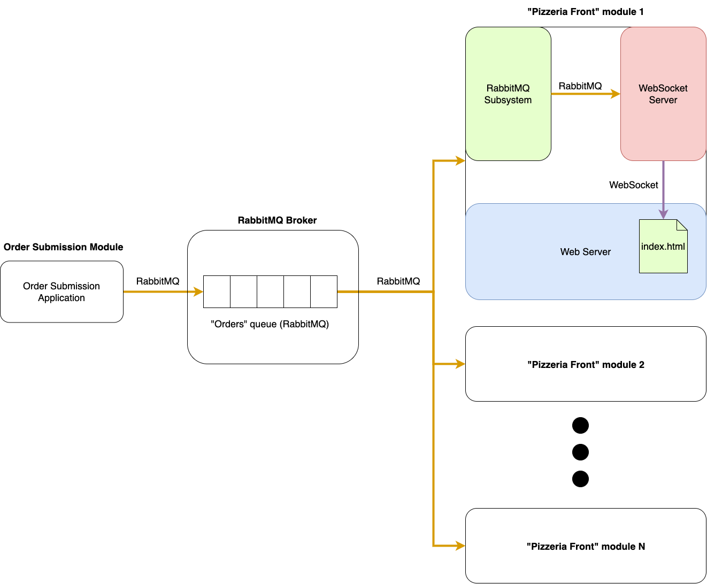

# Rabbit Pizza (Order Submission module)


## About

<p align="center">Small educational project developed to present the concepts of messaging with RabbitMQ middleware for the Distributed Systems course (2021.2) of the Computer Engineering course - UFMA</p>


## Table of Contents
=================

   * [About](#about)
   * [Table of Contents](#table-of-contents)
   * [Project Description](#-project-description)
   * [Prerequisites](#prerequisites)
   * [Installation](#-installation)
   * [Technologies](#-technologies)
   * [Author](#-author)

---

## 💻 Project Description

The project consists of a simple pizza restaurant *marketplace* which uses a distributed architecture based on the use of RabbitMQ messaging middleware. This system has two main subsystems: (a) the "Order Submission" module and (b) the "Pizzeria Front" module.

The "Order Submission" module is responsible for generating orders and placing them in a queue, managed by a RabbitMQ *broker*. These orders must be fulfilled by one of the pizzerias registered in the system. They are notified through the "Pizzeria Front" module, which is responsible for receiving delivery requests for a given pizza flavor at an address.

Upon receiving a request, the "Pizzeria Front" module then forwards the request to a notification subsystem, which uses WebSockets to distribute the alert to the notification panels (represented by a simple web page).

Both modules were implemented and made available in the following projects:
- [Rabbit Pizza (Pizzeria Front module)](https://github.com/rafaelfl/rabbitmq-front-sd-2021-2)
- [Rabbit Pizza (Order Submission module)](https://github.com/rafaelfl/rabbitmq-sd-2021-2)

The architecture of the described system can be seen in the following image.



---

<a name="prerequisites"></a>
## ⚙️ Prerequisites

Before starting, you will need a RabbitMQ *broker* installed at some address. I recommend using a Docker *container*, which can be installed using the following command (considering the latest version so far):

```
docker run -it --rm --name rabbitmq -p 5672:5672 -p 15672:15672 rabbitmq:3.9-management
```

In order to see the system working, it is important to have already installed, configured and run the "Pizzeria Front" module, available at the following [link](https://github.com/rafaelfl/rabbitmq-front-sd-2021-2)

---

## 🚀 Installation

After running the RabbitMQ *broker*, download and configure the "Pizzeria Front" module, you must download and configure the project's .env file, defining, in the `BROKER_ADDRESS` variable, the ip address of your RabbitMQ broker (the default localhost).

```bash
# Clone this repository
$ git clone https://github.com/rafaelfl/rabbitmq-sd-2021-2

# Access the project folder (using terminal/cmd)
$ cd rabbitmq-sd-2021-2

# Install the dependencies
$ yarn install

# Edit the .env file with your configurations

# Run the "Order Submission" module using the following syntax
$ yarn start "PIZZA FLAVOR" "DELIVERY ADDRESS"

# Se você já estiver rodando o módulo Pizzaria, basta acessar o endereço <http://localhost:8080>
# que você verá as notificações enviadas por meio deste projeto na página web. A cada execução
# deste projeto (e envio de um novo pedido) será mostrada uma nova notificação no painel da
# página web.


# If you are already running the "Pizzeria Front" module, just access the address
# <http://localhost:8080> to see the notifications sent through the "Order Submission"
# module. Every order submitted will be shown on the web page.
```

---

## 🛠 Technologies

The following technologies were used to build this project:

- [Node.js](https://nodejs.org/en/)
- [Yarn](https://yarnpkg.com/)
- [RabbitMQ](https://www.rabbitmq.com/)
- [AMQP](https://github.com/amqp-node/amqplib)

---

## 🦸 Author

<a href="https://github.com/rafaelfl/">
 
 <br />
 <sub><b>Prof. Rafael Fernandes Lopes, Ph.D.</b></sub></a>


Developed with 💜 by Rafael Fernandes Lopes

[](https://www.linkedin.com/in/rafael-fernandes-lopes/)
